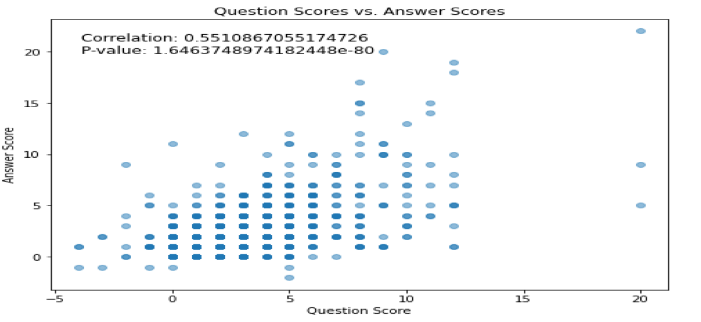
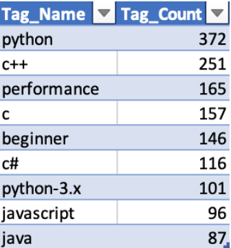
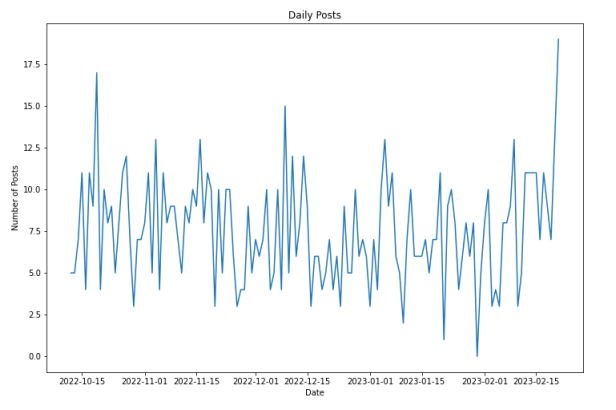
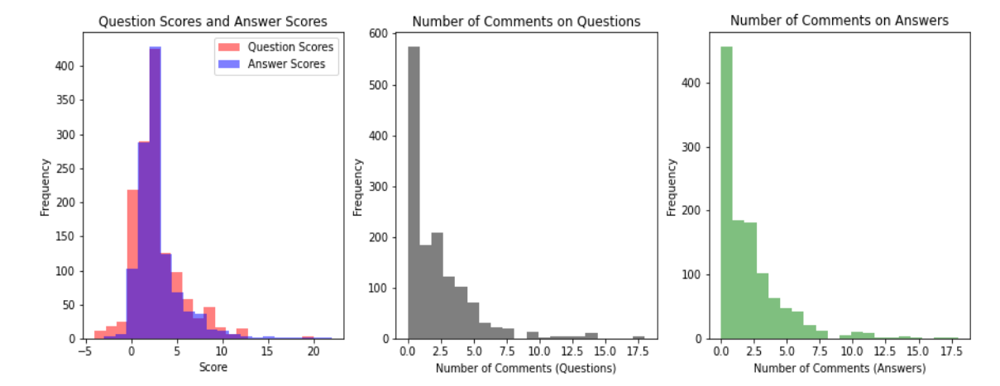

# Stack Exchange Platform Analysis
*An in-depth analysis of user behavior and content patterns on Stack Exchange*

## Key Findings

### Platform Statistics
- Answer acceptance rate: 47.25% (σ = 0.499)
- Average question score: 2.63 (σ = 2.78)
- Average answer score: 2.78 (σ = 2.69)
- Question closure rate: 5.06%
- Average answers per question: 1.66

### Correlation Analysis


Strong positive correlations:
1. Question Score vs Number of Answers (0.584140)
2. Answer Score vs Question Score (0.551087)

Most negative correlation:
- Author Reputation vs Views (-0.029507)

### Tag Distribution Analysis


Most frequent tags across all questions:
1. Python (372 occurrences)
2. C++ (251 occurrences)
3. Performance (165 occurrences)
4. C (157 occurrences)
5. Beginner (146 occurrences)

### Temporal Trends


Post frequency analysis (Oct 2022 - Feb 2023):
- Average daily posts: 7.5
- Peak activity: 17.5 posts/day
- Notable increase in February 2023

### Score Distribution


- Most questions and answers score between 0-5 points
- Strong right-skew in score distribution
- Question scores (μ = 2.63) slightly lower than answer scores (μ = 2.78)

### Comment Patterns
- Questions average 2.04 comments (σ = 2.79)
- Answers average 1.93 comments (σ = 2.54)
- Comment distribution highly right-skewed (skewness > 2.27)

### User Analysis
Key insights about top contributors:
- Highest reputation: 92.8k
- No correlation between reputation and post views
- Most active users have diverse reputation scores (103 to 26.6k)

## Methodology
Analysis performed using Python with:
```python
import pandas as pd
import numpy as np
import matplotlib.pyplot as plt
from scipy.stats import skew, kurtosis, pearsonr
```


## Repository Structure
```
stack-exchange-analysis/
├── images/
│   ├── correlations.png
│   ├── daily_posts.png
│   ├── score_distribution.png
│   └── tags_distribution.png
├── analysis.py
└── README.md
```

*Note: All visualizations generated using Matplotlib with custom styling for clarity.*
